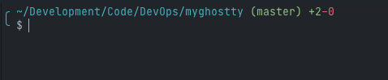

# My Ghostty Settings

## Setup



Run the one-time setup:

```sh
./setup.sh
```

Manual steps if you prefer:

```sh
./setup.sh
```

## Notes

- The prompt shows the current path, git branch, and async git diff stats.
- If the box-drawing glyphs don’t render, swap `╭`/`╰` in `config/shell_settings.sh` for ASCII.
